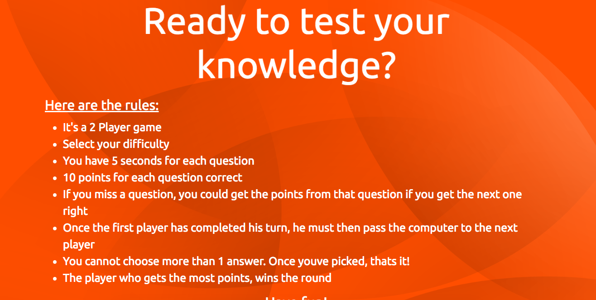
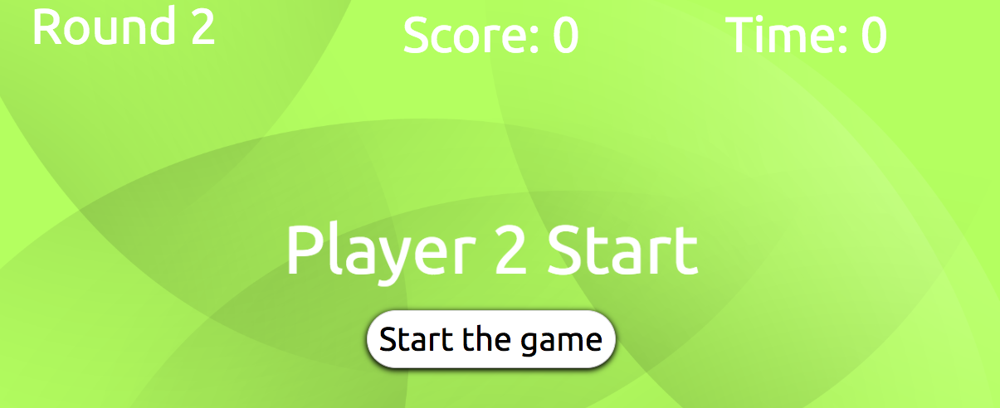
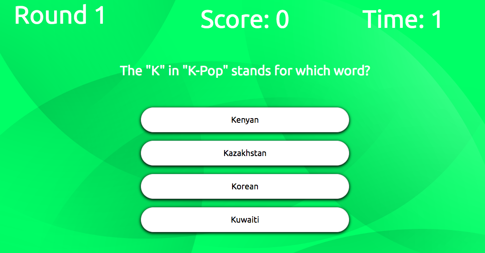

# QDA Quiz

This is a game project that I completed whilst following the Agile ceremonies, in a timeframe of 1 week with 2 sprints, a review, a retrospective and a lookahead.

## Requirements
- Must have Market Viable Product by the end of both sprints.
- Must have an instructions screen.
- Must be 2 player
- Must be well styled
- Must be hosted online
- Must have a leaderBoard
- Must display if the player has won or scores at the end of the game

## Content

### Title screen

This is the screen that the user starts at, where they can choose to start the game or to look at the instructions first.

If the user does not choose a difficulty, then they are met with this:

The user cannot proceed without choosing a difficulty.

### Instructions

If the user would like to see the instructions, they click the instructions button on the title screen and they are taken to this screen:

This screen explains the rules of the game, including how long they have for each question, what they should do when they have completed their turn and what happens when they get the most points.

### Player starting screen

This is the screen that the first player will be met with.

Here they can choose to start the game at their convenience, incase something happens between starting the game and then starting the round.

Player 2 is met with a similar screen after player 1 has completed their turn

### Questions

Using a quiz API with AJAX, questions are stored and then displayed to the user, along with their relevant answers. The answers can then be clicked and they will display a colour determining whether the user was correct or incorrect. Points will increase if they are correct.

The user can only choose 1 answer. After that, they must wait for the timer to go to the next question.

### Winner screen

After player 2 has completed their turn, a screen shows with an announcement of who won the game. It also has a text input box for the winning user to input their name for the leaderboard.

Once the user has inputted their name, they can click the button and it will take them to the leaderBoard

### The leaderboard

This screen shows all of the previous players and scores, in order to invoke competition between users, in turn, increasing playability
